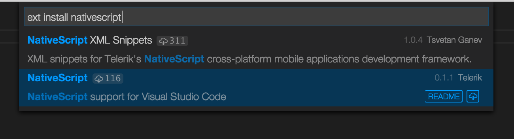
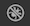
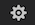
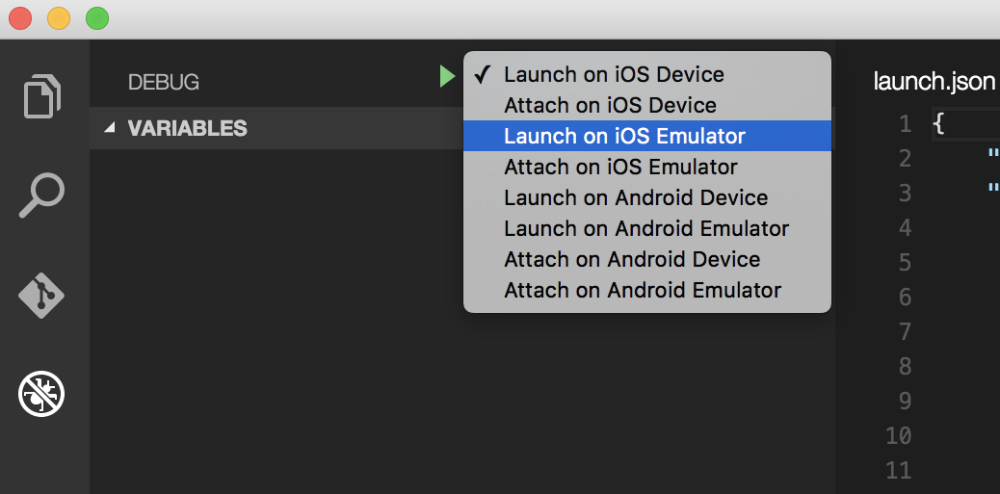
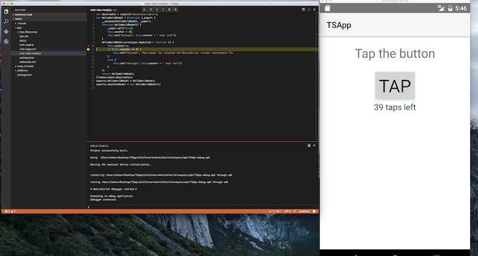
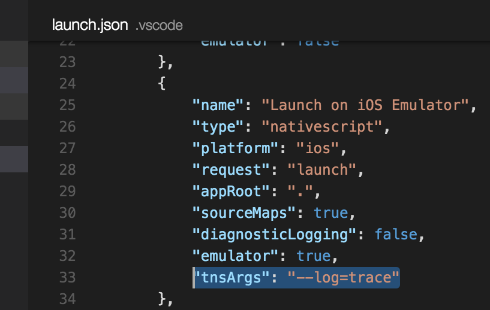
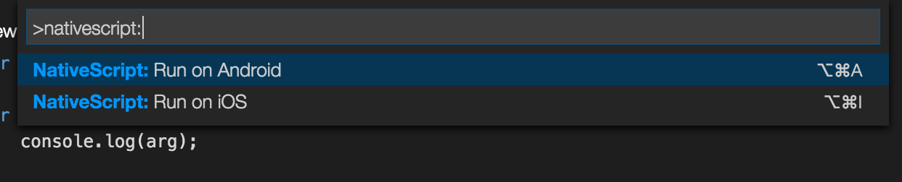
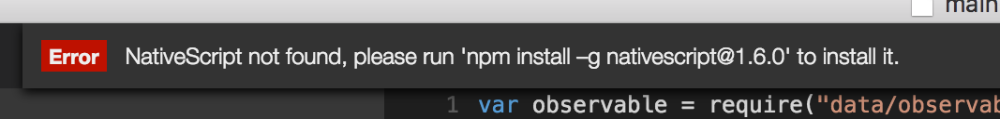

# NativeScript Extension for Visual Studio Code

0. [Installation](#installation)
2. [Debugging](#debugging)
  1. [Generate launch configurations](#generate-launch-configurations)
  2. [Launch an application with debugger](#launch-an-application-with-debugger)
  3. [Attach the debugger to already running app](#attach-the-debugger-to-already-running-app)
  4. [TypeScript support](#typescript-support)
  5. [Supply additional arguments to the debug command](#supply-additional-arguments-to-the-debug-command)
  6. [Turn on debugging protocol diagnostic logging](#turn-on-diagnostic-logging)
3. [Use NativeScript specific commands](#use-nativescript-specific-commands)
4. [NativeScript CLI Version Detection](#nativescript-cli-version-detection)

## Installation

To install the [NativeScript extension for Visual Studio Code](https://marketplace.visualstudio.com/items?itemName=Telerik.nativescript) open the Command Palette (`F1` or `Cmd+Shift+P`) and run `Extensions: Install Extension` command, then search for 'NativeScript' and choose it from the list.

If you have installed it successfully, it will appear in the list of installed extensions. You can see it if you run `Extensions: Show Installed Extensions` command from the Command Palette.

## Debugging

Open your application folder in VS Code (your application folder is the one created by `tns create` command, not your `app` folder).

### Generate launch configurations

Click the debugging icon  in the View bar, and then click the gear icon  to choose the NativeScript debug environment. A `launch.json` file should be generated in your `.vscode` folder located next to the `app` folder. The configurations, described in `launch.json` can be selected from the menu in the Debug Panel.

### Launch an application with debugger

Choose one of the launch configurations (e.g. `Launch on iOS Emulator`) and press the `Start` button next to the menu. This will run your app on the iOS emulator and attach the VS Code debugger. The app should break on the first JavaScript/TypeScript statement. More information about the debugging support in VS Code can be found in the [VS Code Debugging Guide](https://code.visualstudio.com/docs/editor/debugging).

### Attach the debugger to already running app

If you have already running NativeScript application on your Android/iOS emulator/device you can attach the VS Code debugger to it, without rebuilding and restarting the application. Just choose the right attach configuration from the debug configuration menu, depending on the platform and the target of the app, and press the start button.

### TypeScript support

In case you are writing your app in TypeScript you have fully functional debugging support in Visual Studio Code. To debug TypeScript, make sure the TS compiler is producing source maps by setting `"sourceMap": true"` in your `tsconfig.json`.

However, instead of manually setuping TS compiler options and TS build tasks we strongly recommend using the [TypeScript plugin for NativeScript](https://github.com/NativeScript/nativescript-dev-typescript) which handles all configuration settings and garantees smooth integration with Visual Studio Code.

### Supply additional arguments to the debug command

Starting a particular debug configuration, under the hood executes `tns debug` command with various arguments. You can append additional arguments by supplying them in the `tnsArgs` property of a debug configuration definition in `launch.json`. For example if you add `"tnsArgs": "--log=trace"` in the `Launch on iOS Emulator` configuration, under the hood VS Code will execute `tns debug ios --emulator --no-client --log=trace` command, which will give you more verbose information in the Debug Console.

### Turn on diagnostic logging

If the `diagnosticLogging` flag for a particular debug configuration in `launch.json` file is set to `true` (its default value is `false`), diagnostic messages will be logged on the debugger console after attaching the debugger to the NativeScript application. This is useful for rough debugging of the extension itself, because all sent/received messages which are part of the communication between the frontend and the backend are logged.

## Use NativeScript specific commands

Type `nativescript` in the Command Palette and you will see all NativeScript specific commands. Currently there are only two of them but the list will grow in the future.

Run command is the equivalent to `tns run` in the NativeScript CLI. It allows you to build, deploy and run your app on emulator/device directly from Visual Studio Code.

## NativeScript CLI Version Detection

The extension is depending on a globally installed NativeScript CLI. It will show an error message if it can't find it.

> The extension is supposed to work with a specific NativeScript CLI version and if you have another version installed you will see a warning message. You can still use it with the inconsistent version of the CLI and it's likely to work seamlessly but we recommend updating either the NativeScript CLI or the VS Code extension.